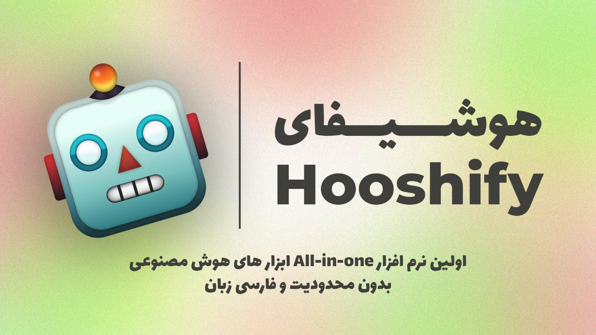

# Hooshify AI — Complete Guide

Hooshify AI is a desktop chatbot application built with Python and CustomTkinter. This guide provides a complete walkthrough for installation, configuration, usage, and troubleshooting.



## Highlights

- Local user accounts and profiles stored in SQLite under `data/users.db`.
- Groq-focused model mapping (default: `gpt-oss-20b`).
- GUI built with CustomTkinter; Persian fonts included in the `fonts/` directory.

## Prerequisites

- Python 3.10 or newer
- pip

## Quick Install

1. Clone the repository and enter the project folder:

```bash
git clone <repo-url>
cd Hooshify-AI
```

2. (Recommended) create and activate a virtual environment:

```bash
python3 -m venv .venv
source .venv/bin/activate
```

3. Install Python dependencies:

```bash
pip install -r requirements.txt
```

## Configuration: Environment Variables (API keys)

Recommended: create a `.env` file at the project root. The application loads `.env` automatically.

Example `.env`:

```env
# Groq (for gpt-oss models)
GROQ_API_KEY="gsk_xxx_you_put_here"
GROQ_MAX_TOKENS=1024

# Optional / legacy keys
LLM7_API_KEY=""
OPENAI_API_KEY=""
AVALAI_API_KEY=""
HUGGINGFACE_API_KEY=""
```

Notes:

- `GROQ_MAX_TOKENS` controls maximum output tokens for Groq requests (default 1024) to help avoid provider limits.
- Or export variables in shell:

```bash
export GROQ_API_KEY="gsk_xxx"
export GROQ_MAX_TOKENS=1024
python3 run.py
```

## Running the app

- Primary launcher: `python3 run.py` — opens the main menu.
- You can run individual screens for development, e.g. `python3 src/Chatbot_en.py`.

## Database behavior (auto-recreate)

- DB file: `data/users.db`.
- `ensure_database()` in `src/common.py` creates the DB and tables if missing. Deleting `data/users.db` removes stored users; running the app recreates the database (previous data lost).

## Fonts and Persian text

- Fonts are included in `fonts/`. The UI uses `Vazir` or available system Persian fonts (IRANSans) when available.

## Model list (Groq-focused)

- Default Groq models included in the app:
  - `gpt-oss-20b` (default)
  - `gpt-oss-12b`
  - `gpt-oss-6.7b`
  - `gpt-oss-3b`

Change model mappings in `src/config.py`.

## Groq notes & common errors

- If you receive quota/size errors like `Request too large` or `rate_limit_exceeded`:
  - Reduce `GROQ_MAX_TOKENS` in `.env` (try 512 or 1024).
  - Trim or summarize chat history before sending.
  - Upgrade your Groq plan to increase token/rate limits.

## Project structure

- `src/` — main application source files (Chatbot_en.py, Menu_en.py, Playground_en.py, etc.)
- `assets/images/` — UI images and icons
- `fonts/` — font files
- `data/` — local SQLite DB
- `requirements.txt` — dependencies
- `run.py` — launcher script

## Quick checks and troubleshooting

- Syntax/import check:

```bash
python3 -m py_compile src/Chatbot_en.py src/Playground_en.py
```

- Missing `.venv` activate error → create virtual environment as shown above.

## Common issues

- `NameError` for LEFT/END/RIGHT: ensure `from tkinter import LEFT, END` is present.
- Groq errors: usually API key or provider limits; copy the provider error for detailed help.
- Fonts: ensure fonts from `fonts/` are available on the system when Persian text doesn't render correctly.

## Contributing / adding models

- Edit `src/config.py` to add or change model mappings.
- If you want live streaming output in the UI, I can change `ask_llm7_model` to push chunks directly to the chat textbox.

## Git & collaboration

- Keep `.env` in `.gitignore` (project already ignores `.env`). Do not commit secret keys.

## Need more help?

- I can:
  - Implement live streaming in the UI,
  - Add automatic DB backup before deletion,
  - Or expand API examples and message format docs.

If you want any section expanded (API examples, message format, or history-summarization tips), tell me which part and I will add it.
